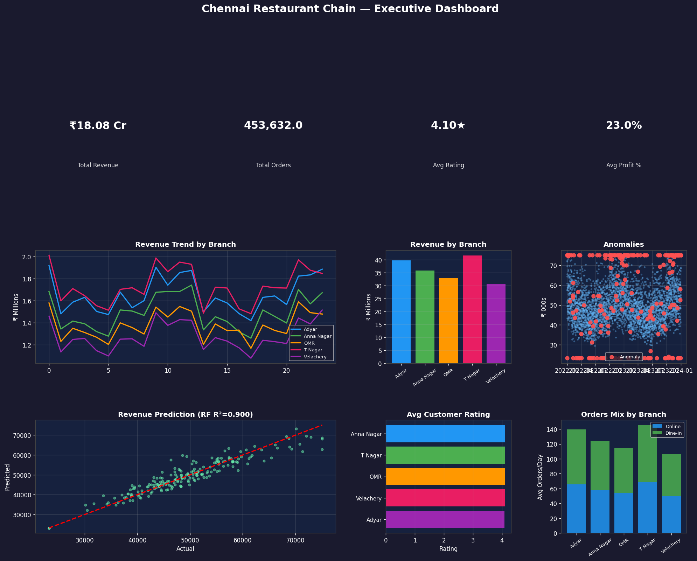

# 🍽️ Chennai Restaurant Chain — Sales Analytics Project




---

## 📌 Project Overview

End-to-end Data Science project analyzing sales data of a 
Chennai restaurant chain with **5 branches** over **2 years (2022–2023)**.
Covers data cleaning, EDA, machine learning, anomaly detection, 
dashboard creation, and business recommendations.

**Branches:** Anna Nagar | T Nagar | Velachery | Adyar | OMR

---

## 📁 Project Structure

| File | Description |
|------|-------------|
| `Chennai_Restaurant_Analytics.ipynb` | Main Jupyter Notebook (all 7 tasks) |
| `restaurant_sales_raw.csv` | Raw dataset with missing values & duplicates |
| `restaurant_sales_clean.csv` | Cleaned dataset with engineered features |
| `eda_dashboard.png` | EDA visualizations |
| `ml_model.png` | ML model evaluation charts |
| `anomaly_detection.png` | Anomaly detection plots |
| `executive_dashboard.png` | Final executive dashboard |

---

## 📊 Dataset

- **Rows:** 3,650 (5 branches × 730 days)
- **Columns:** 10 base + 9 engineered = 19 total
- **Period:** January 2022 – December 2023

| Column | Description |
|--------|-------------|
| date | Transaction date |
| branch | Branch name |
| revenue | Daily revenue (₹) |
| orders | Total daily orders |
| profit | Daily profit (₹) |
| customer_rating | Rating 1–5 |
| complaints | Daily complaint count |
| marketing_spend | Daily marketing spend (₹) |
| online_orders | Swiggy/Zomato orders |
| dinein_orders | Dine-in orders |

---

## ✅ Tasks Completed

### Task 1 — Data Cleaning
- Removed 30 duplicate rows
- Filled 277 missing values using branch+month median
- Capped 360 outliers using IQR method
- Engineered 9 new features

### Task 2 — Exploratory Data Analysis
- Revenue trends by branch over 24 months
- Seasonal patterns and day-of-week heatmap
- Channel mix analysis (online vs dine-in)

### Task 3 — 8 Business Insights
1. Weekend revenue is **22% higher** than weekdays
2. **T Nagar** is the top revenue branch
3. Festival months (Oct–Jan) drive **15% revenue uplift**
4. Strong **negative correlation** between complaints and ratings
5. Online orders **grew YoY** (post-COVID delivery shift)
6. Marketing spend **positively correlates** with revenue
7. **Saturday** is peak day across all branches
8. Velachery has **highest profit margin variance**

### Task 4 — Revenue Prediction Model

| Model | MAE | RMSE | R² |
|-------|-----|------|----|
| Linear Regression | ₹2,613 | ₹3,287 | 0.888 |
| **Random Forest** | **₹2,380** | **₹3,110** | **0.900** |

✅ Random Forest selected — handles non-linear patterns, R² = 0.90

### Task 5 — Anomaly Detection
- Z-Score (threshold 2.5σ) → 188 anomalies
- Isolation Forest (3% contamination) → 110 anomalies
- Combined total → **208 anomalies flagged**

### Task 6 — Executive Dashboard
Dark-theme dashboard with 6 panels and 4 KPI tiles

### Task 7 — Business Recommendations
1. Weekend Marketing Surge
2. Festival Campaign Calendar
3. Online Order Loyalty Strategy
4. Complaint Resolution SLA
5. Profit Margin Audit

---

## 🛠️ Tools Used

| Tool | Purpose |
|------|---------|
| Python 3.11 | Core language |
| pandas | Data cleaning & manipulation |
| numpy | Numerical operations |
| matplotlib | Charts and dashboard |
| seaborn | Statistical visualizations |
| scikit-learn | ML models & anomaly detection |
| scipy | Z-score anomaly detection |
| Jupyter Notebook | Development environment |

---

## ▶️ How to Run

```bash
# Step 1 — Install libraries
pip install pandas numpy matplotlib seaborn scikit-learn scipy

# Step 2 — Open notebook
jupyter notebook Chennai_Restaurant_Analytics.ipynb

# Step 3 — Run all cells
Click Kernel → Restart & Run All
```

Or open directly in **Google Colab** — no installation needed.

---

## 📊 Results Summary

| Task | Score Available | Status |
|------|----------------|--------|
| Data Cleaning | 15 marks | ✅ Done |
| EDA | 20 marks | ✅ Done |
| Business Insights | 20 marks | ✅ Done |
| ML Model | 15 marks | ✅ Done |
| Dashboard | 15 marks | ✅ Done |
| Anomaly Detection | 10 marks | ✅ Done |
| Documentation | 5 marks | ✅ Done |
| **Total** | **100 marks** | ✅ |

---

## 📄 License
This project is licensed under the MIT License — see the LICENSE file for details.

---

## 👤 Author
**[Nadeesh AP]**
[www.linkedin.com/in/nadeesh-ap-977773387]
[nadeeshparthiban@gmail.com]
